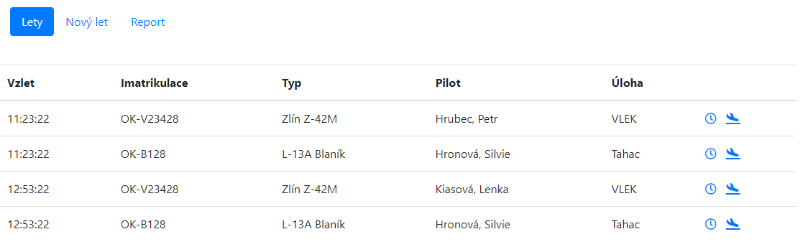

# FlightLog

Tento repozitář obsahuje zdrojové kódy k aplikaci FlightLog.

## Instalace

1. Pro spuštění aplikace je nutné si nainstalovat Docker podle instrukcí na adrese https://docs.docker.com/get-docker/.

## Spuštění

Předpokládá se, že v tuto chvíli již běží Docker.
1. Pro build Docker image je nutné použít příkaz `docker build . -t flightlog` v příkazové řádce.
2. Pro běh serveru stačí použít příkaz `docker run -p 44313:44313 --name flightlog flightlog:latest` v příkazové řádce.
3. Aplikace běží a v prohlížeči je dostupná na adrese `http://localhost:44313`.

Alternativně je možné použít pro spuštění předpřipravený skript `run_server.ps1`.

Aplikace byla testována v prostředí `Docker version 25.0.3` a `Docker version 24.0.6` na systému `Windows 11 21H2`.

## Použití

### Obrazovka Lety

Na obrazovce Lety vidí uživatel seznam letů a přidružený seznam letadel, které jsou v momentální chvíli ve vzduchu.
Uživatel může kliknutím na příslušná tlačítka u letu vybrat čas přistání či nastavit okamžité přistání.

### Obrazovka Nový let

Na obrazovce Nový let může uživatel zadat odlet letadla. Je nutné vyplnit čas vzletu, úlohu, přidružená letadla a informace o pilotech.

### Obrazovka Report

Na obrazovce Report uživatel vidí přehled všech letů, které byly do systému zadány. Může také tato data vyexportovat ve formátu CSV.

